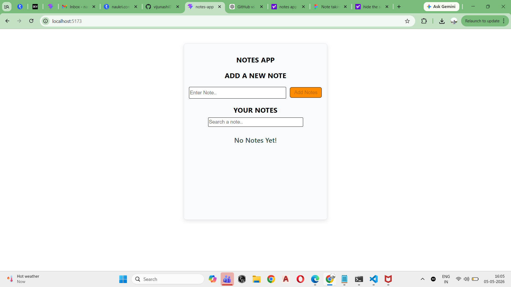
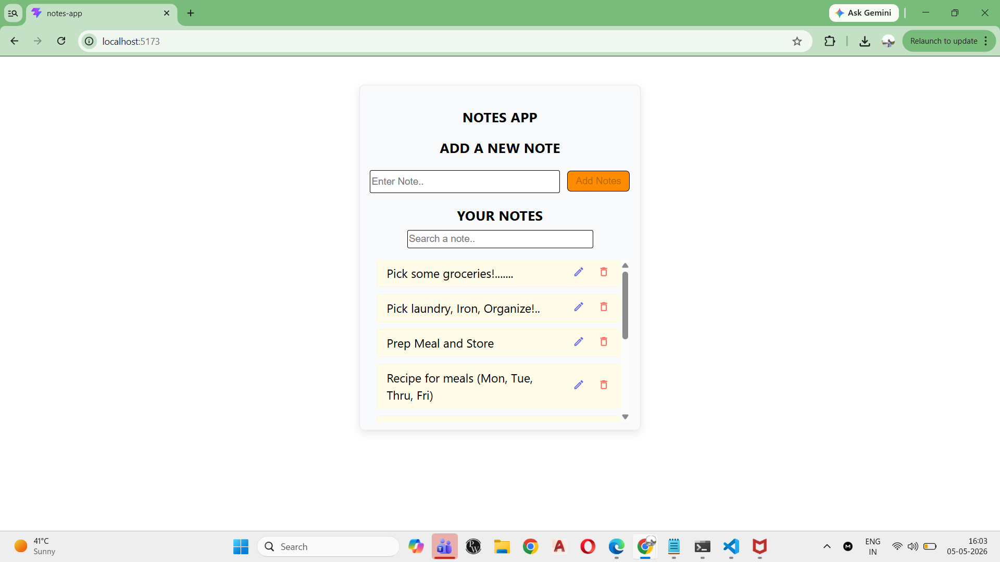
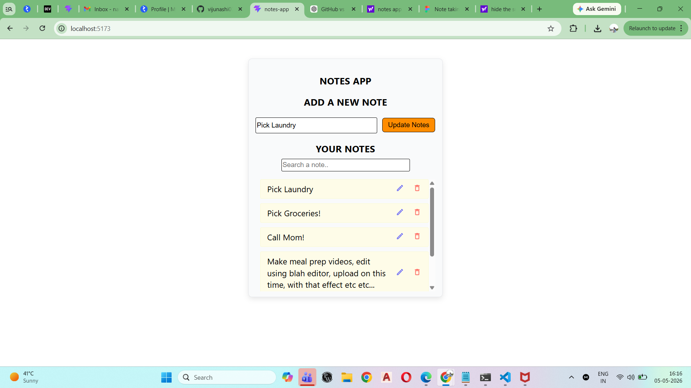

# Notes App (React)

## 🚀 Features

* Add, edit, delete notes
* Persistent storage using localStorage
* Search notes with debounce
* Clean component-based architecture

## 🛠️ Tech Stack

* React (Hooks)
* JavaScript
* CSS

## 📸 Screenshots

## 📦 How to Run

1. Clone the repo
2. Run `npm install`
3. Run `npm start`

## ✨ Key Concepts

* useState, useEffect
* Custom Hooks (useDebounce)
* Debouncing for performance
* Controlled components
* Immutability in state updates
